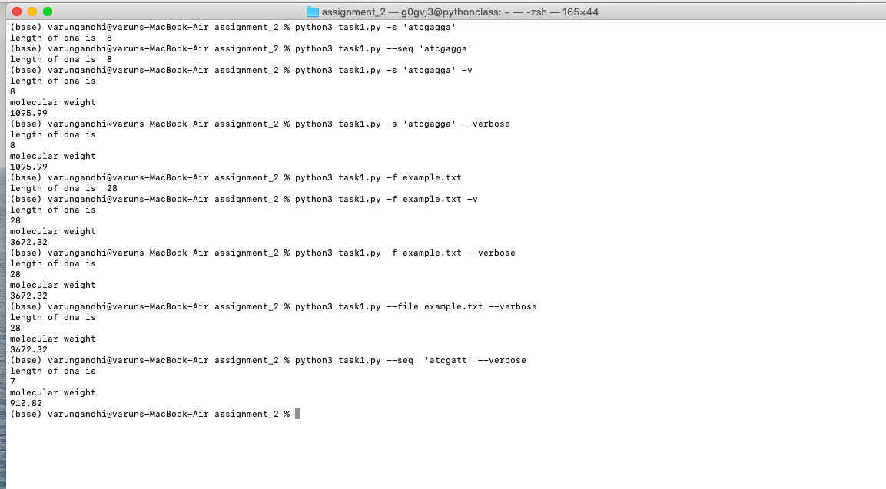
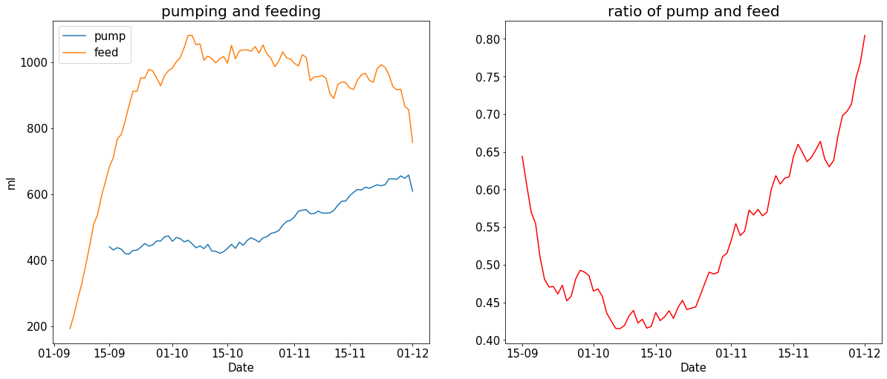

## Description for using the task1.py:

### Here I provide a description of how a command line string and file can be used with the DNA class by providing various parameters: 

* -s or --seq can be used to provide a DNA as a string on the terminal, providing this parameter will give the length of the DNA
* -f or --file can be used to provide a DNA file where the DNA sequence is present as a string:
    * Here we give an example where example.txt has the DNA sequence
    * using this parameter (alone) for reading a file will print out the length of the DNA.
* -v or --verbose can be used with any of the two options above. Using the above parameters with -v or --verbose will give both the length of the DNA and its molecular weight

### Images (terminal), How to use the parameters along with the task1.py file

* In the above picture we can see that using the optional parameter -s or --seq prints out the length of the DNA
* Using optional parameter -f or --file along with the file name will print out the length of the DNA as weel
* Using -v or --verbose as the optional parameter along with -s or --seq and -f or --file will print out the length of the DNA as well as its molecular weight 

### Task2 figure:

